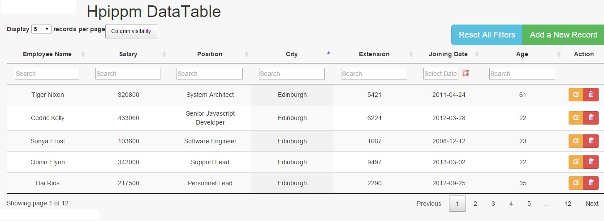

# DataTables - Advanced for general Use
jQuery Datatables Advanced use with Raw PHP AJAX.

Output will be like this-

ALL external JS and CS are used from CDN. Also all of them are saved in the project directory.

Installation-
-------------

The database is included with the package. It should be set up with localhost and PHP file's DB configuration should be set up.

Thanks.
